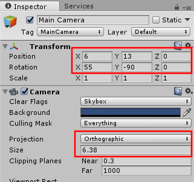
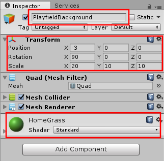
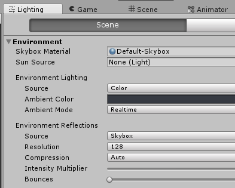
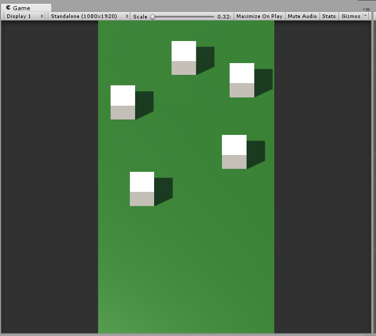
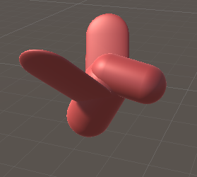
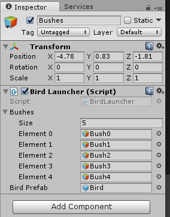
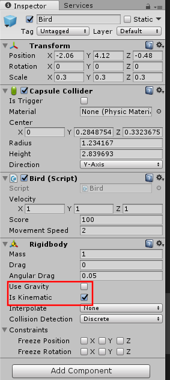

# Adding GUI Scene

## Add a Background

The basic idea of our game is a bird watching game. On the screen, we will display a bunch of bushes. When you shoot a ramp, a bird will randomly fly out of one of the bushes. Hitting the bird with the ball will take a photo of the bird.

We are going to set up our landscape, and get birds spawning. Lets start with adding to our scene.

In the Unity editor, open the scene BWTHome. This is currently the default scene created when we did the add scene. Let's add some stuff.

* Modify the MainCamera
    * 
* Create a Quad using GameObject > 3D Object > Quad and name it PlayfieldBackground
    * Create a new Material call it HomeGrass and assign it to PlayfieldBackground.
    <br>

* In Window > Lighting > Settings. Change Environment Lighting Source to color.
    <br>

## Create Some Bushes

* Create an empty `GameObject` and name it Bushes.
* Create 5 cubes as child objects. Call them Bush0 through Bush4. Lay them out across the playfield as you like. They should look something like this. 
<br>
{: .note }
I should have taken the time to create a prefab at this point, instead of copying the cube. We will correct this later. I chose to leave this in so others can learn from the mistake, but you can save yourself some work by creating a prefab now.

## Bird Prefab

Create a bird prefab. This could be a capsule, or another cube, or whatever you like. We could make this nicer later. I created a simple bird-like shape using 4 capsules. Make a prefab from your bird in `Assets/Resources/prefabs/BWT`by dragging the bird shape into that folder.



In order to see the score, we will use the framework prefab for the apron display. Add `Assets/Resources/Prefab/ApronDisplay` to the scene.

## Adding P3Aware Scripts

We are going to add a `P3Aware` script to our `GameObject`.

{: .note }
`P3Aware` is a class that extends `MonoBehavior`. It provides us with the a mechanism to communite between our game layer and our GUI layers. This allows our GUI objects to react to physical events and mode based events. See the SDK documentation for detailed discussion of the GUI layer.

Let's create some scripts to control our elements. Add a new script `GUI/BWTHome/BirdLauncher.cs`. We will create 2 public members to store the bushes and bird prefab.

{: .filename }
Assets/Scripts/GUI/BWTHome/BirdLauncher.cs

```csharp
using UnityEngine;
using Multimorphic.P3App.GUI;
using Gammagoat.BWT.Modes;

namespace Gammagoat.BWT.GUI
{
    public class BirdLauncher : P3Aware
    {
        public GameObject[] Bushes;
        public GameObject BirdPrefab;
    
        public override void Start ()
        {
            base.Start ();
        }
    
        protected override void CreateEventHandlers()
        {
            base.CreateEventHandlers ();
        }
        
        // Update is called once per frame
        public override void Update ()
        {
            base.Update ();
        }
    }
}
```

In Unity, we can now add this to our Bushes object. In the inspector, click Add Component and select the Bird Launcher script. We can drag our prefab bird to the BirdPrefab, and create an array of size 5 with our 5 bushes.



Add an `EventHandler` for the `SpawnBird` event.

{: .filename }
Assets/Scripts/GUI/BWTHome/BirdLauncher.cs

```csharp
        protected override void CreateEventHandlers()
        {
            base.CreateEventHandlers ();
            AddModeEventHandler(BWTEventNames.SpawnBird, SpawnBirdEventHandler);
            AddModeEventHandler(BWTEventNames.SpawnBirdFromIndex, SpawnBirdFromIndexEventHandler);
        }

        // This is a simple helper that can be called from AppConfig keyboard shortcut.
        private void SpawnBirdEventHandler(string eventName, object eventData)
        {
            SpawnBirdFromIndexEventHandler(eventName, 0);
        }

        private void SpawnBirdFromIndexEventHandler(string eventName, object eventData)
        {
            int bushIndex = (int)eventData;
            GameObject bird = Instantiate(BirdPrefab, Bushes[bushIndex].transform.position + new Vector3(0,0.5f,0), Quaternion.LookRotation(new Vector3(1,0,0), new Vector3(0,1,0)));
            bird.transform.SetParent(transform,true);
            Destroy(bird, 5);
        }
```

Add the two strings to our `BWTEventNames.cs`.

{: .filename }
Assets/Scripts/Modes/BWTEventNames.cs

```csharp
        public const string SpawnBird = "Evt_SpawnBird";
        public const string SpawnBirdFromIndex = "Evt_SpawnBirdFromIndex";
        public const string BirdHit = "Evt_BirdHit";
```

Before we go any further, we need to configure a way to test this. We will add a call to `Configuration/AppConfig.json`.

{: .filename }
Configuration/AppConfig.json

```json
    {"Key":"B",               "ModeToGuiEvent":"Evt_SpawnBird","Data":"0"},
```

You should be able to run the program, start a game with  and then spawn birds using . The bird should appear, but will not yet move.

## Making the Bird Interact With The Ball

Add another `P3Aware` script for our bird: `GUI/BWTHome/Bird.cs`. We add a public `MovementSpeed` member variable and move the bird in the `Update` method.

{: .filename }
Assets/Scripts/GUI/BWTHome/Bird.cs

```csharp
using UnityEngine;
using Multimorphic.P3App.GUI;
using Gammagoat.BWT.Modes;

namespace Gammagoat.BWT.GUI
{    
    public class Bird : P3Aware
    {
        public Vector3 Velocity;
        public float MovementSpeed;
    
        public override void Start ()
        {
            base.Start ();
        }

        protected override void CreateEventHandlers()
        {
            base.CreateEventHandlers ();
        }
    
        // Update is called once per frame
        public override void Update ()
        {
            base.Update ();
            transform.position = transform.position + new Vector3(
                    Velocity.x * MovementSpeed * Time.deltaTime,
                    Velocity.y * MovementSpeed * Time.deltaTime,
                    Velocity.z * MovementSpeed * Time.deltaTime);
        }
    }
}
```

Add the script as a component to your Bird prefab, and set the `MovementSpeed` to 2. We will add in a random `_velocity` to the birds we spawn. Modify `SpawnBirdFromIndexEventHandler` as follows:

{: .filename }
Assets/Scripts/GUI/BWTHome/BirdLauncher.cs

```csharp
        private void SpawnBirdFromIndexEventHandler(string eventName, object eventData)
        {
            int bushIndex = (int)eventData;
            // Generate a random flight vector. We constrain it to be upwards.
            Vector3 velocity = new Vector3(Random.Range(-2f, 2.0f), Random.Range(0.0f, 1.0f),Random.Range(-2f, 2.0f));
            // To make the bird face the direction of of movement, we use LookRotation.
            GameObject bird = Instantiate(BirdPrefab, Bushes[bushIndex].transform.position + new Vector3(0,0.5f,0), Quaternion.LookRotation(velocity, new Vector3(0,1,0)));
            bird.transform.SetParent(transform,true);
            bird.GetComponent<Bird>().Velocity = velocity;
            Destroy(bird, 5);
        }
```

Running this code in the simulator, spawned birds should now fly away. The final step is to make the bird be hittable by the ball. We need to add a Collider and a Rigidbody. Make sure to set the "Is Kinematic" and remove "Use Gravity".



In `Bird.cs` create an `OnTriggerEnter` method. It is called every time another `GameObject` with a `Collider` hits this object. We will act if it is the `Ball`. 

{: .filename }
Assets/Scripts/GUI/BWTHome/Bird.cs

```csharp
        public int Score = 100;

        public void OnTriggerEnter(Collider other)
        {
            // Only respond to ball hits
            if (other.name == "BallAvatarTrail")
            {
                PostGUIEventToModes(BWTEventNames.BirdHit, Score);
                popupScores.Spawn("Photo Taken", Score, transform.position, 1);
                Destroy(gameObject);
            }
        }
```

You should now be able to spawn birds using , and then hit the bird with the ball using the mouse and it will destroy and pop up scoring text on the screen.
