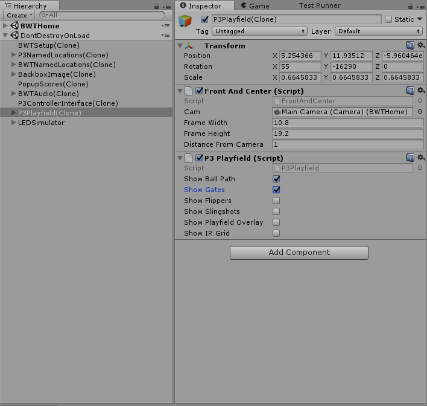
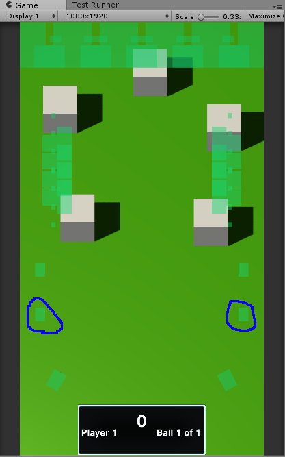
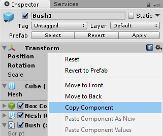
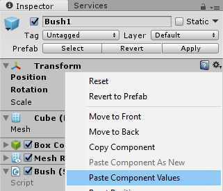
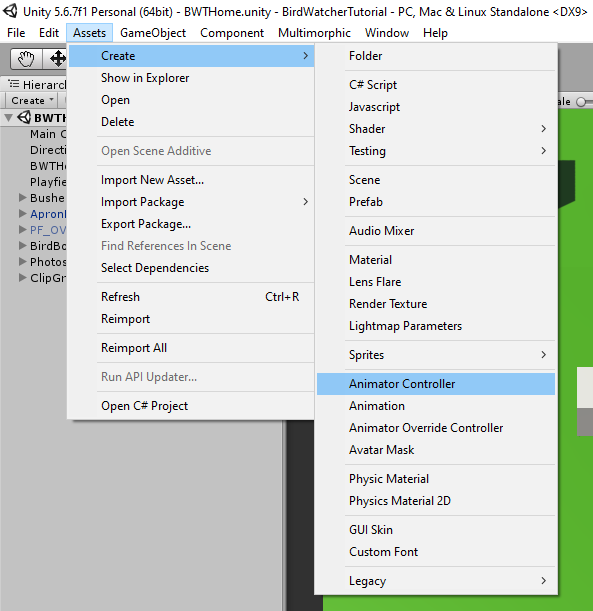
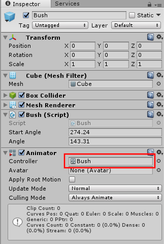
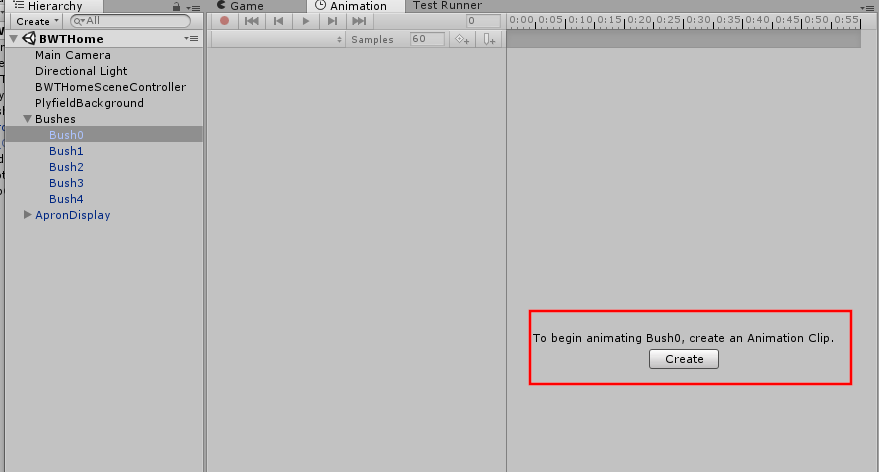
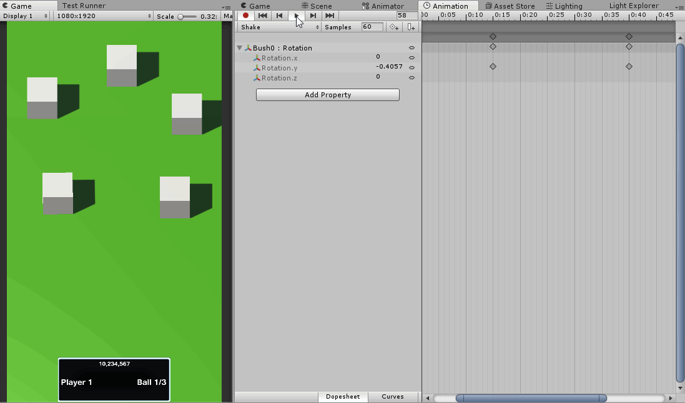
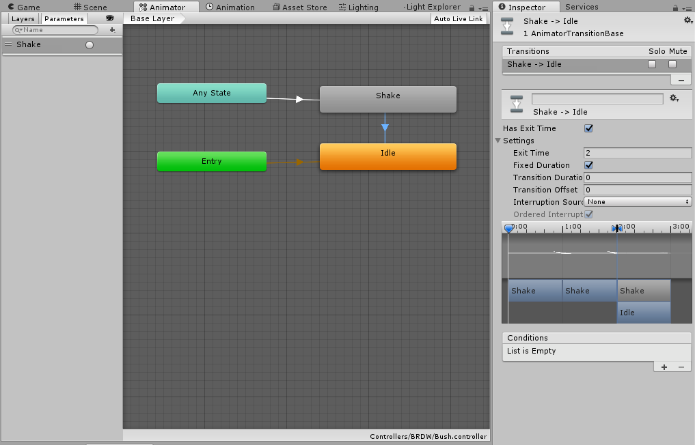
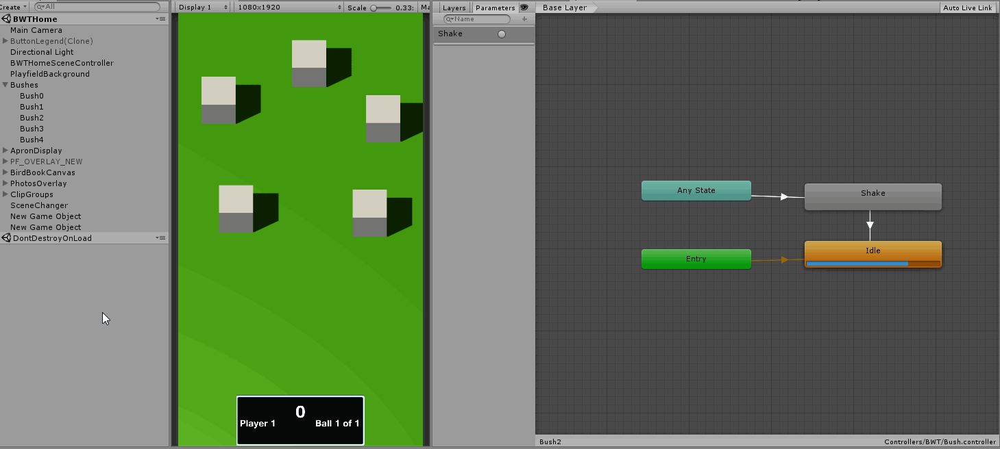

# Delaying the Birds

## Adding Inlane Events

Our birds launch too fast. By the time the ball gets to the flipper, the bird has already moved across the screen. So we want to delay the launch after the ramp is hit.

We could accomplish this simply by using a delay callback or something similar and it would work. But we are trying to make this work with any module, and the amount of delay might depend on the particular ramp we are hitting.

So instead, we use the ball entering the inlane as our trigger. We can use the screen tracking to accomplish this. We don't need to do any work to define it, as the framework already has a gate defined for use for the inlane. Take a look at `Assets/Scripts/Modes/Mechs/ShotsMode.cs` which listens to the GUI events for these and fires the appropriate Mode to Mode (M2M) events, eg. `"Evt_InlaneRightLower"`

Add the constants for these event names to our `BWTEventNames` along with a `Shake` for later.

{: .filename }
Assets/Scripts/Modes/BWTEventNames.cs

```csharp
        public const string InlaneRightLower =  "Evt_InlaneRightLower";
        public const string InlaneLeftLower =  "Evt_InlaneLeftLower";
        public const string Shake =  "Evt_Shake";
```

Create a new `InlaneEventHandler` for `BirdRampMode` and modify the existing `RampHitEventHandler`. Our plan is as follows:

  * On ramp hit, assign a variable to indicate that we should spawn on inlane.
    * Generate two possible launch locations and send a visual indicator to the player which two bushes are possible.
  * When inlane is triggered, spawn a bird if our indicator variable is set.

Add new private member variables to `BirdRampMode`.

{: .filename }
Assets/Scripts/Modes/GameModes/BirdRampMode.cs

```csharp
        private bool _bushReady;
        private int _nextSpawnIndex;
        private System.Random _rand;
```

Register the `EventHandler` in the constructor and initialize our valuables explicitly.

{: .filename }
Assets/Scripts/Modes/GameModes/BirdRampMode.cs

```csharp
            // Gammagoat.BWT.Modes.BirdRampMode.BirdRampMode

            AddModeEventHandler(BWTEventNames.InlaneRightLower, InlaneEventHandler, Priority);
            AddModeEventHandler(BWTEventNames.InlaneLeftLower, InlaneEventHandler, Priority);

            _bushReady = false;
            _nextSpawnIndex = -1;
            _rand = new System.Random();
```

Add the following `EventHandlers`:

{: .filename }
Assets/Scripts/Modes/GameModes/BirdRampMode.cs

```csharp
        private bool RampHitEventHandler(string eventName, object eventData)
        {
            Multimorphic.P3App.Logging.Logger.Log("Ramp hit. Spawning Bird.");

            // We will generate 2 possible places to spawn.
            int B1 = _rand.Next(5);
            int B2 = _rand.Next(4);
            // We select [0,3] and if we selected the same thing as before change it to 4. This does sampling without replacement.
            if (B1 == B2)
            {
                B2 = 4;
            }
            // Indicate that to inlane that we are ready to lauch
            _bushReady = true;
            // Post visual hints to the GUI layer
            PostModeEventToGUI(BWTEventNames.Shake, B1);
            PostModeEventToGUI(BWTEventNames.Shake, B2);
            _nextSpawnIndex = B1;
            return EVENT_CONTINUE;
        }

        private bool InlaneEventHandler(string eventName, object eventData) {
            if (_bushReady)
            {
                Multimorphic.P3App.Logging.Logger.Log("Inlane: " + eventName + "Crossed. Spawning Bird from index: " + _nextSpawnIndex.ToString());
                _bushReady = false;
                // We are using a string because of how we configured the Spawn event in AppConfig.
                SpawnBirdEventHandler(eventName, _nextSpawnIndex.ToString());
            }
            return EVENT_CONTINUE;
        }
```

To test this code in the Editor, we need to be able to trigger the ramp hit, and then the inlane. We already know how to configure to send events using `AppConfig.json`. Let's set the  key to hit the left ramp.

{: .filename }
Configuration/AppConfig.json

```json
    {"Key":"R",               "ModeToModeEvent":"Evt_Shot_RightRampToPassthrough","Data":""},
```

We can trigger the inlane via the mouse in the simulator, but it is hard to know where the inlane is. We can add the PF_OVERLAY_NEW prefab to our scene and it will allow us to see the mechs overlayed on our game view which is really helpful. But we can also use the P3Playfield object which is added by the framework at runtime as a `DoNotDestroy`. 

Start your game. Then find the P3Playfield(clone) `GameObject`, and enable "Show Gates" in the inspector. This shows the gates in green on the playfield. The two I have circled are the lower inlane gates.





You should now be able to press  to trigger RightRamp and then mouse over the right inlane to trigger the bird (actually either inlane, we don't check that it is the correct one).

## Shaking the Bushes

We want to add a visual warning to the player of where the bird will spawn, but I don't want to make it too easy. We will show one of two possible locations. To show that a bird might fly out, I am thinking a rustling bush would be good. We will do this using animation on our `Bush`.

We have come to the realization that our `Bush` should have been a prefab. If it was a prefab, we could change the prefab and apply it to all of bushes. Fixing this will be a little annoying but will set us up better for the future. We will take Bush0, and drag it to the `Assets/Resources/Prefab/BWT` and change the location to (0,0,0) and rename it Bush.

We need to replace all our bushes with instances of this prefab and then redo the launch settings and locations. You can use the "Copy Component" and "Paste Component Values" to copy over the transform and the launch angle settings. Then update the Bushes array and delete the old instances.




  * Add new new Animation Controller "Bush" in Controllers/BWT
  <br> 
  * Add an Animator component to the Bush prefab and set the Animation Controller to the Bush controller we just created.
  <br> 
  * In Animations/BWT create a new animation Shake.
  <br> 

Add a new rotation property to the Animation. Then we will set 2 key frames, one around 0:15 with rotation.y 25 and the other around 0:40 with rotation.y -14. You can use your creativity here. The animation should now be able to produce something like this.



In the Animation, do the following

  * Create state Idle as the default state
  * Create state Shake with animation Shake
  * Create a parameter of type trigger called Shake
  * Create a transition from Any State to Shake on parameter Shake
  * Create a transition from Shake to Idle with a 2 second duration



You can test that everything is working by running your program, selecting any of the bushes and clicking on the Shake trigger.



We are ready to trigger this from the mode layer. Add a public `Shake()` method to `Assets/Scripts/GUI/BWTHome/Bush.cs`:

{: .filename }
Assets/Scripts/GUI/BWTHome/Bush.cs

```csharp
        public void Shake()
        {
            GetComponent<Animator>().SetTrigger("Shake");
        }
```

Register a new `EventHandler` in `BirdLauncher.CreateEventHandlers`

{: .filename }
Assets/Scripts/GUI/BWTHome/BirdLauncher.cs

```csharp
            // Gammagoat.BWT.GUI.BirdLauncher.CreateEventHandlers

            AddModeEventHandler(BWTEventNames.Shake, ShakeEventHandler);
```

Add the implementation for the `ShakeEventHandler`:

{: .filename }
Assets/Scripts/GUI/BWTHome/BirdLauncher.cs

```csharp
        private void ShakeEventHandler(string eventName, object eventData)
        {
            int bushIndex = (int)eventData;
            Bushes[bushIndex].GetComponent<Bush>().Shake();
        }
```

Running the simulator, when you press  it should now shake two random bushes, and if you roll over the inlane gate it should spawn a bird.
