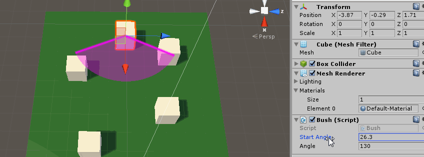

# Launch Direction

## Adding StartAngle and Angle

In order to restrict the directions that the birds can launch, let's add some parameters to our bushes. Create a new script and add it to every bush.

Create `Assets/Scripts/GUI/BWTHome/Bush.cs`

{: .filename }
Assets/Scripts/GUI/BWTHome/Bush.cs

```csharp
using UnityEngine;

#if UNITY_EDITOR
using UnityEditor;
#endif

using Multimorphic.P3App.GUI;

namespace Gammagoat.BWT.GUI
{    
    public class Bush : P3Aware
    {
        public float StartAngle;
        public float Angle;

        public override void Start ()
        {
            base.Start ();
        }

        protected override void CreateEventHandlers()
        {
            base.CreateEventHandlers ();
        }

        /* Select a random direction to spawn a bird from StartAngle and Angle.
        */
        public Vector3 RandomDirection()
        {
            float t = Random.Range(0.0f, Angle);
            Vector3 arcVector = Quaternion.AngleAxis(StartAngle, Vector3.up) * Vector3.forward;
            arcVector.Normalize();
            arcVector = Quaternion.AngleAxis(t , Vector3.up) * arcVector;

            // Select a random vertical velocity
            arcVector.y = Random.Range(0.3f, 1.0f);
            arcVector.Normalize();
            return arcVector;
        }

        // Update is called once per frame
        public override void Update ()
        {
            base.Update ();
        }
    }
}
```

In `BirdLauncher`, change the velocity to use the bush random direction.

{: .filename }
Assets/Scripts/GUI/BWTHome/BirdLauncher.cs

```csharp
            // Gammagoat.BWT.GUI.BirdLauncher.SpawnBirdFromIndexEventHandler

            Vector3 velocity = Bushes[bushIndex].GetComponent<Bush>().RandomDirection();
```

## Adding a Gizmo

Our current implementation works, but it is incredibly difficult to visualize the range and set the two parameters. Luckily, Unity gives us capabilities to extend the GUI. We will extend the scene view to show a "Gizmo" of an arc representing the range that the birds can launch. Add the following method.

{: .filename }
Assets/Scripts/GUI/BWTHome/Bush.cs

```csharp
#if UNITY_EDITOR
        /* We will draw a gizmo which consists of the min / max vectors of the arc, and a coloured solid arc. This is the range the birds can launch into.
        */
        public void OnDrawGizmosSelected()
        {
            Handles.color = new Color( 1, 0, 1, 0.2f );

            Vector3 arcVectorMin = Quaternion.AngleAxis(StartAngle, Vector3.up) * Vector3.forward;
            Handles.DrawBezier(transform.position,transform.position + arcVectorMin*3,transform.position, transform.position + arcVectorMin*3, Color.magenta,null,7.0f);

            Vector3 arcVectorMax = Quaternion.AngleAxis(Angle, Vector3.up) * arcVectorMin;
            Handles.DrawBezier(transform.position,transform.position + arcVectorMax*3,transform.position, transform.position + arcVectorMax*3, Color.magenta,null,7.0f);

            Handles.DrawSolidArc(transform.position, Vector3.up, arcVectorMin, Angle, 3f);	
        }
#endif
```



As written, we could set out-of-bounds values and we want to fix that. Again, Unity provides us with a member function of MonoBehavior to handle this. An `OnValidate` method is called when a script is loaded or values are updated. It can be used to limit ranges on values.

{: .filename }
Assets/Scripts/GUI/BWTHome/Bush.cs

```csharp
        public void OnValidate()
        {
            while (StartAngle < 0)
            {
                StartAngle = StartAngle + 360;
            }
            while (StartAngle > 360)
            {
                StartAngle = StartAngle - 360;
            }
            if (Angle < 0)
            {
                Angle = 0;
            }
            if (Angle > 360)
            {
                Angle = 360;
            }
        }
```