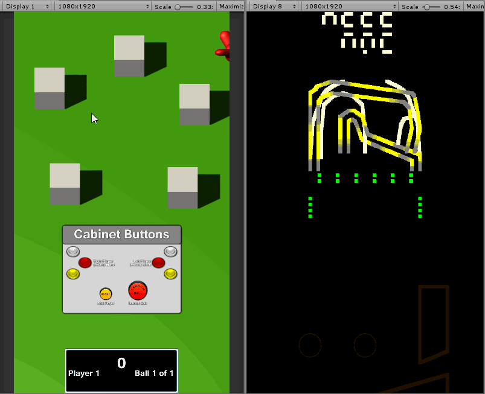

# Light Shows

The final component we are going to add to our game is light shows. We want to implement

  * Background light show for BWTHome
  * Ramp lightshow to indicate the shots that will spawn birds
  * Flash when we take a photo

## Default Lamps

Following the example of the `P3SampleApp`, we create a series of default light values for every light. We are going to use the `Names` and `Tags` to define these defaults. We want to default the playfield inserts to be off. There is no consistent `Tag` for this, so we will create a static method to identify these playfield inserts.

We will create a new class with some helper static definitions. Create `Assets/Scripts/Modes/LightShows/BWTLedManager.cs`

{: .filename }
Assets/Scripts/Modes/LightShows/BWTLedManager.cs

```csharp
using System;
using System.Collections.Generic;
using Multimorphic.NetProcMachine.Machine;

namespace Gammagoat.BWT.Modes
{
    public class BRWDLedManager 
    {		
        public static readonly HashSet<string> Inserts = new HashSet<string>
        {
            // Heist
            "sideLoop", "jailRight", "jailLeft",
            // WAMONH
            "sideLoopLeft", "viP", "miniLoopLeft", "cameraTarget", "sideLoopRight", "ticketCounterArrow",
            "vIp", "hamsterTarget", "rightRamp", "suppliesLower", "miniLoopRight", "rightLoop", "Vip",
            "leftRamp", "leftLoop", "suppliesArrow", "suppliesUpper", //TODO finish
        };
        public static readonly ushort[] DarkGrey = new ushort[] {10, 10, 10, 255};
        public static readonly ushort[] Sunlight = new ushort[] {253, 251, 211, 255};

        public static bool IsPlayfiedInsert(string name)
        {
            return Inserts.Contains(name);
        }
        public static bool IsCabinetLed(LED led)
        {
            if (Array.Exists<string>(led.Tags, x => x == "BaseP3"))
            {
                if (led.Name.Contains("scoop") || led.Name.Contains("wall") || led.Name.Contains("SideModule"))
                {
                    return false;
                }
                return true;
            }
            return false;
        }
    }
}
```

Now we are ready to define `DefaultLamps`. We will define

  * Green
    * SideModule
    * Walls
    * Scoops
  * DarkGrey
    * Flashers
    * Inserts
  * LightGreen
    * BaseP3 (cabinet lights, speaker lights, backbox)
  * Sunlight
    * playfield lights
    * everything else

Here is the implementation.

{: .filename }
Assets/Scipts/Modes/BWTHomeMode.cs

```csharp
        private void DefaultLamps()
        {
            for (int i=0; i<LEDScripts.Count; i++)
            {
                if (LEDScripts[i].led.Name.Contains ("SideModule"))
                    LEDScripts[i] = LEDHelpers.OnLED (p3, LEDScripts[i], Multimorphic.P3.Colors.Color.green);
                else if (BRWDLedManager.IsPlayfiedInsert(LEDScripts[i].led.Name))
                    LEDScripts[i] = LEDHelpers.OnLED (p3, LEDScripts[i], BRWDLedManager.DarkGrey);
                else if (LEDScripts[i].led.Name.Contains ("flasher"))
                    LEDScripts[i] = LEDHelpers.OnLED (p3, LEDScripts[i], BRWDLedManager.DarkGrey);
                else if (LEDScripts[i].led.Name.Contains ("wall") || LEDScripts[i].led.Name.Contains("scoop"))
                    LEDScripts[i] = LEDHelpers.OnLED (p3, LEDScripts[i], Multimorphic.P3.Colors.Color.green);
                else if (LEDScripts[i].led.Name == "playfield")
                    LEDScripts[i] = LEDHelpers.OnLED(p3, LEDScripts[i], BRWDLedManager.Sunlight);
                else if (Array.Exists<string>(LEDScripts[i].led.Tags, x => x == "BaseP3"))
                    LEDScripts[i] = LEDHelpers.OnLED(p3, LEDScripts[i], Multimorphic.P3.Colors.Color.lightorange );
                else 
                    LEDScripts[i] = LEDHelpers.OnLED (p3, LEDScripts[i], BRWDLedManager.Sunlight);
            }
        }
```

In `mode_started` add a call to `DefaultLamps()`.

{: .filename }
Assets/Scipts/Modes/BWTHomeMode.cs

```csharp
            // Gammagoat.BWT.Modes.BWTHomeMode.mode_started

            DefaultLamps();
```

There are some high priority light shows for the backbox and playfield that are added by the `BaseGameMode`. Disable this by adding this to the constructor of `BWTBaseGameMode`

{: .filename }
Assets/Scipts/Modes/BWTBaseGameMode.cs

```csharp
            // Gammagoat.BWT.Modes.BWTBaseGameMode.BWTBaseGameMode

            base.useBackboxColorsMode = false;
```

## Highlighting the Ramps

Next we will create a generic light show to highlight our ramps using the information in the configuration. Create a new `GameMode` in `Assets/Scripts/Modes/LightShows/HighlightRampMode.cs`

{: .filename }
Assets/Scripts/Modes/LightShows/HighlightRampMode.cs

```csharp
using System;
using System.Text.RegularExpressions;
using System.Collections.Generic;
using System.Diagnostics;

using Multimorphic.NetProcMachine.LEDs;
using Multimorphic.P3;

namespace Gammagoat.BWT.Modes
{
    public class HighlightRampMode : BWTGameMode
    {       
        private List<KeyValuePair<string, float>> _sortedLEDs;
        private List<List<string>> _entranceLEDs;
        List<LEDScript> LocalLEDScripts;

        public HighlightRampMode (P3Controller controller, int priority, List<List<string>> entranceLEDs )
            : base(controller, priority)
        {
            _entranceLEDs = entranceLEDs;
        }
       
        public override void mode_started ()
        {
            LocalLEDScripts = new List<LEDScript>();
        }

        public override void mode_stopped ()
        {
            for (int i=0; i<LocalLEDScripts.Count; i++)
            {
                p3.LEDController.RemoveScript(LocalLEDScripts[i]);
            }
            LocalLEDScripts.Clear();
            base.mode_stopped();
        }
    }
}
```

This creates a mode that stores the list of `entranceLEDs` in its constructor. It removes all the `LightShows` in `mode_stopped`, but we don't yet create any light shows.

Create a helper method that parses the `entranceLEDs` and generates a list of pairs. We use a `KeyValuePair` as a basic pair type. This is a hack, but it is a hack I use a lot in Unity because there is no built-in Pair generic in C#. I could write one, but this works.

We are going to handle two types of lights. Named lights like you will get from the `entranceLEDs` on for example Heist, and light strings like on CCR. 

{: .bug }
This method will not work in general because it will get the direction wrong for some paths, but it will work for the ramps on CCR.

{: .filename }
Assets/Scripts/Modes/LightShows/HighlightRampMode.cs

```csharp
        private void AddLedsToList(List<List<string>> lightList, out List<KeyValuePair<string, float>> output)
        {
            Regex re = new Regex("^(.*)([0-9]+)-([0-9]+)$");
            output = new List<KeyValuePair<string, float>>();

            foreach (List<string> list in lightList)
            {
                int index=0;
                foreach (string name in list)
                {
                    // led string like "rightRampInner0-131"
                    if (name.Contains("-"))
                    {
                        Match m = re.Match(name);
                        string baseName = m.Groups[1].Value;
                        int startIndex = Int32.Parse(m.Groups[2].Value);
                        int endIndex = Int32.Parse(m.Groups[3].Value);
                        Debug.Assert(startIndex <= endIndex, "startIndex is less than endIndex on name:" + name);
                        for (int i = startIndex; i<= endIndex; i++ )
                        {
                            string ledName = baseName + i.ToString();
                            float dist = (float)i / (float)endIndex;
                            output.Add(new KeyValuePair<string, float>(baseName + i.ToString(), dist)); 
                        }
                    }
                    // Named led like "leftRamp"
                    else
                    {
                        output.Add(new KeyValuePair<string, float>(name, (float)index / (float)list.Count));
                    }
                    index++;
                }
            }
        }
```

Now we can write our `mode_started`.

{: .filename }
Assets/Scripts/Modes/LightShows/HighlightRampMode.cs

```csharp
        public override void mode_started ()
        {
            _sortedLEDs = new List<KeyValuePair<string, float>>();
            AddLedsToList(_entranceLEDs, out _sortedLEDs );
            LocalLEDScripts = new List<LEDScript>();
            foreach (KeyValuePair<string, float> pair in _sortedLEDs)
            {
                LEDScript script = new LEDScript( p3.LEDs[pair.Key], this.Priority);
                script.AddCommand(Multimorphic.P3.Colors.Color.yellow, 0.1, 1);
                script.AddCommand(Multimorphic.P3.Colors.Color.grey, 0.5, 1);
                LocalLEDScripts.Add (script);
                float offset = pair.Value * 4.0f;
                offset -= (float)Math.Floor(offset);
                p3.LEDController.AddScript(script, -1, offset*2);
            }
        }
```

In `BirdRampMode`, create a new private member variable to store our new light shows.

{: .filename }
Assets/Scripts/Modes/GmaeModes/BirdRampMode.cs

```csharp
using System.Collections.Generic;

        private List<HighlightRampMode> _lightshows;
```

Initialize it in the constructor.

{: .filename }
Assets/Scripts/Modes/GmaeModes/BirdRampMode.cs

```csharp
            // Gammagoat.BWT.Modes.BirdRampMode.BirdRampMode

            _lightshows = new List<HighlightRampMode>();
```

Modify `mode_started`.

{: .filename }
Assets/Scripts/Modes/GmaeModes/BirdRampMode.cs

```csharp
        public override void mode_started ()
        {
            base.mode_started ();
            _photoCount = 0;
            int timeToNextBird = _rand.Next(7) + 3;
            this.delay(RandomBirdLaunch, Multimorphic.NetProc.EventType.None, (double)(timeToNextBird), new Multimorphic.P3.VoidDelegateNoArgs (LaunchRandomBird));
            foreach (HighlightRampMode lightshow in _lightshows)
            {
                p3.AddMode(lightshow);
            }
        }
```

In our constructor, modify our `BallPathDefinition` loop as follows:

{: .filename }
Assets/Scripts/Modes/GmaeModes/BirdRampMode.cs

```csharp
            // Gammagoat.BWT.Modes.BirdRampMode.BirdRampMode

            foreach (BallPathDefinition shot in p3.BallPaths.Values)
            {  
                if (shot.ExitName == "LeftInlane" || shot.ExitName == "RightInlane")
                {
                    Multimorphic.P3App.Logging.Logger.Log("[BirdRampMode] Setup shot: " + shot.CompletedEvent);
                    AddModeEventHandler(shot.CompletedEvent, RampHitEventHandler, priority);
                    HighlightRampMode lightshow = new HighlightRampMode(p3, Priority, shot.EntranceLEDs);
                    _lightshows.Add(lightshow);
                }
            }
```

Clean up and remove the scripts in our `mode_stopped`.

{: .filename }
Assets/Scripts/Modes/GmaeModes/BirdRampMode.cs

```csharp
        public override void mode_stopped()
        {
            base.mode_stopped();
            foreach (HighlightRampMode lightshow in _lightshows)
            {
                p3.RemoveMode(lightshow);
            }
            _lightshows.Clear();
        }
```

We want to test this on different playfields. Try running it on both Heist and CCR. You can change this by editing AppConfig.

{: .filename }
Configuration/AppConfig.json

```csharp
    "ModuleID": "CCR",
```

If we run this in CCR, we should get something like this


## Camera Flash

The final light show we are going to write is a "flash"-like effect when we hit the birds. Our idea is to do a complete horizontal sweep of white light from the location of the bird.

Create a new `GameMode` `Assets/Scripts/Modes/LightShows/CameraFlashMode.cs`. Like before, create a very similar stub.

{: .note }
We should probably refactor this into a new base class, which is essentially what `Assets/Scripts/Modes/Mechs/LightShow.cs` does with the LightShow class.

{: .filename }
Assets/Scripts/Modes/LightShows/CameraFlashMode.cs

```csharp
using System;
using System.Collections.Generic;

using Multimorphic.NetProcMachine.Machine;
using Multimorphic.NetProcMachine.LEDs;
using Multimorphic.P3;

namespace Gammagoat.BWT.Modes
{
    public class CameraFlashMode : BWTGameMode
    {
        List<LEDScript> LocalLEDScripts;
        private float[] _center;

        public CameraFlashMode (P3Controller controller, int priority, float[] center)
            : base(controller, priority)
        {
            _center = center;
        }

        public override void mode_started ()
        {
            LocalLEDScripts = new List<LEDScript>();
        }

        public override void mode_stopped ()
        {
            for (int i=0; i<LocalLEDScripts.Count; i++)
            {
                p3.LEDController.RemoveScript(LocalLEDScripts[i]);
            }
            LocalLEDScripts.Clear();
            base.mode_stopped();
        }
    }
}
```

We compute the delay of our script based of the horizontal distance of the LED to the `_center` point. We will exclude cabinet lights from the light show. Here is the `mode_started` implementation.

{: .filename }
Assets/Scripts/Modes/LightShows/CameraFlashMode.cs

```csharp
        public override void mode_started ()
        {
            LocalLEDScripts = new List<LEDScript>();

            foreach (LED led in p3.LEDs.Values) {
                if (BRWDLedManager.IsCabinetLed(led))
                {
                    continue;
                }

                LEDScript script = new LEDScript(led, this.Priority);
                double delay = 0;

                if (led.Location != null)
                {
                    delay = Math.Abs((_center[0] - led.Location[0]) / 10.0)*0.1;
                }
            
                script.AddCommand(Multimorphic.P3.Colors.Color.off, 0, 0.05);                
                script.AddCommand(Multimorphic.P3.Colors.Color.on, 0, 0.1);
                script.AddCommand(BRWDLedManager.DarkGrey, .3, 5);
            
                script.autoRemove = true;
                LocalLEDScripts.Add (script);
                p3.LEDController.AddScript(script, 1.2 - delay, delay);
            }
        }
```

Now we need to trigger `CameraFlashMode`. But first, we need to modify the `OnTriggerEnter` of our `Bird` to pass the location down to our Game Layer. We will use the `KeyValuePair` datastructure again. We need to project into screen space, so in `PhotoManager`, add this new method.

{: .filename }
Assets/Scripts/GUI/BWTHome/PhotoManager.cs

```csharp
        public Vector3 GetScreenPosition(Vector3 pos)
        {
            return MainCamera.WorldToScreenPoint(pos);
        }
```

Change the `Bird.OnTriggerEnter`:

{: .filename }
Assets/Scripts/GUI/BWTHome/Bird.cs

```csharp
using System.Collections.Generic;

        private float[] ScreenSpaceToModuleSpace(Vector3 pos)
        {
            float width = 1080f;
            float height = 1920f;
            float widthConversion = 20f; // This is probably wrong, but good enough for this example.
            float heightConversion = 20f; // this is wrong, and not used.
            return new float[] {(float)(pos[0]/width)*widthConversion, (float)(pos[1]/height)*heightConversion, 0};
        }

        public void OnTriggerEnter(Collider other)
        {
            if (_lockout)
            {
                return;
            }
            // Only respond to ball hits
            if (other.name == "BallAvatarTrail")
            {
                _lockout = true;
                Vector3 pos = _photoManager.GetComponent<PhotoManager>().GetScreenPosition(transform.position);
                PostGUIEventToModes(
                    BWTEventNames.BirdHit,
                    new KeyValuePair<int, float[]>(Score, ScreenSpaceToModuleSpace(pos)));
                _photoManager.GetComponent<PhotoManager>().TakePhoto(PhotoPrefab, transform.position);
                Destroy(gameObject);
            }
        }
```

In `BirdRampMode`, add a private member to store the `_cameraFlashMode`. We only need to be running one at a time, so we don't need a list.

{: .filename }
Assets/Scripts/Modes/GameModes/BirdRampMode.cs

```csharp    
        private CameraFlashMode _cameraFlashMode;
```

In our constructor add:

{: .filename }
Assets/Scripts/Modes/GameModes/BirdRampMode.cs

```csharp
            // Gammagoat.BWT.Modes.BirdRampMode.BirdRampMode

            _cameraFlashMode = null;
```

And in our `mode_stopped` we add:

{: .filename }
Assets/Scripts/Modes/GameModes/BirdRampMode.cs

```csharp    
        public override void mode_stopped()
        {
            base.mode_stopped();
            foreach (HighlightRampMode lightshow in _lightshows)
            {
                p3.RemoveMode(lightshow);
            }
            _lightshows.Clear();
            if (_cameraFlashMode != null)
            {
                p3.RemoveMode(_cameraFlashMode);
                _cameraFlashMode = null;
            }
        }
```

Change `BirdRampMode.BirdHitEventHandler` to: 

{: .filename }
Assets/Scripts/Modes/GameModes/BirdRampMode.cs

```csharp    
        public void BirdHitEventHandler(string eventName, object eventData)
        {
            KeyValuePair<int, float[]> hit = ( KeyValuePair<int, float[]>)eventData;
            ScoreManager.Score(hit.Key); 
            _photoCount++;
            if (_cameraFlashMode != null)
            {
                p3.RemoveMode(_cameraFlashMode);
                _cameraFlashMode = null;
            }
            _cameraFlashMode = new CameraFlashMode(p3, Priority + 2, hit.Value );
            p3.AddMode(_cameraFlashMode);
        }
```

Running this in the simluator and hitting a bird, you should get something like this.


