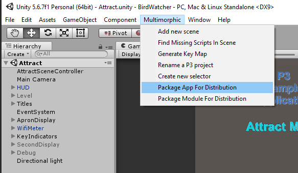
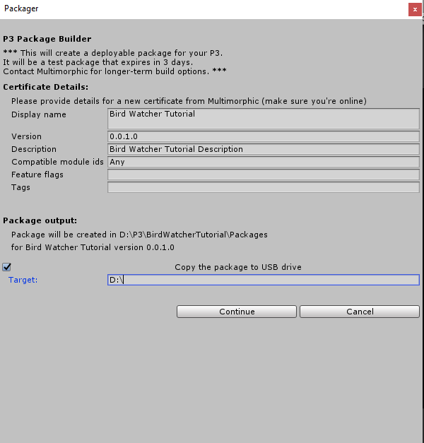
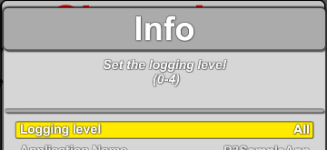

# Ramp Mode

## Adding a New GameMode

Now that we have our GUI layer setup, we need to introduce a `GameMode` to use it. Add `Assets/Scripts/Modes/GameModes/BirdRampMode.cs`. We will start with two `EventHandlers`, one to use as a debug to spawn birds and one to handle the response to the bird being hit.

{: .filename }
Assets/Scripts/Modes/GameModes/BirdRampMode.cs

```csharp
using System;
using Multimorphic.P3;
using Multimorphic.P3App.Modes;
using Multimorphic.NetProcMachine.Config;

namespace Gammagoat.BWT.Modes
{
    public class BirdRampMode : BWTGameMode
    {		
        public BirdRampMode (P3Controller controller, int priority)
            : base(controller, priority)
        {
            AddModeEventHandler(BWTEventNames.SpawnBird, SpawnBirdEventHandler, Priority);
            AddGUIEventHandler(BWTEventNames.BirdHit, BirdHitEventHandler);
        }

        public override void mode_started ()
        {
            base.mode_started ();
        }
    
        public void BirdHitEventHandler(string eventName, object eventData)
        {
            int score = (int)eventData;
            ScoreManager.Score(score);			
        }

        public bool SpawnBirdEventHandler(string eventName, object eventData)
        {
            int bushIndex = Int32.Parse((string)eventData);
            PostModeEventToGUI(BWTEventNames.SpawnBirdFromIndex, bushIndex);
            return EVENT_STOP;
        }
    }
}
```

In `BWTHomeMode`, we will add a private member variable for the new mode, initialize it in our constructor, add it in our `mode_started` and remove it during `mode_stopped`.

{: .filename }
Assets/Scripts/Modes/BWTHomeMode.cs

```csharp
        private BirdRampMode _birdRampMode;

        public BWTHomeMode (P3Controller controller, int priority, string SceneName)
            : base(controller, priority, SceneName)
        {
            _ballStarted = false;
            _birdRampMode = new BirdRampMode(p3,BWTPriorities.PRIORITY_BIRD_RAMPS);

            AddModeEventHandler(BWTEventNames.InitialLaunch, InitialLaunchEventHandler, Priority);
        }

        public override void mode_started ()
        {
            base.mode_started ();
            p3.AddMode(_birdRampMode);
        }

        public override void mode_stopped ()
        {
            base.mode_stopped();
            p3.RemoveMode(_birdRampMode);
        }
```

In `BWTPriorities` add:

{: .filename }
Assets/Scripts/Modes/BWTPriorities.cs

```csharp
        public const int PRIORITY_BIRD_RAMPS = PRIORITY_HOME + 51;
```

And in `Configuration/AppConfig.json` we add new debugging controls to spawn from each bush.


{: .filename }
Configuration/AppConfig.json

```json
    {"Key":"Alpha1",           "ModeToModeEvent":"Evt_SpawnBird","Data":"0"},
    {"Key":"Alpha2",           "ModeToModeEvent":"Evt_SpawnBird","Data":"1"},
    {"Key":"Alpha3",           "ModeToModeEvent":"Evt_SpawnBird","Data":"2"},
    {"Key":"Alpha4",           "ModeToModeEvent":"Evt_SpawnBird","Data":"3"},
    {"Key":"Alpha5",           "ModeToModeEvent":"Evt_SpawnBird","Data":"4"},
```

If you run this in the Editor, you should now be able to spawn birds from the five bushes using the numbers  to .

## Adding in ShotPaths

In the `BirdRampMode` constructor, we will parse the P3 config and add ramp hit event handlers.

{: .filename }
Assets/Scripts/Modes/GameModes/BirdRampMode.cs

```csharp
            // Gammagoat.BWT.Modes.BirdRampMode.BirdRampMode

            foreach (BallPathDefinition shot in p3.BallPaths.Values)
            {	
                if (shot.ExitName == "LeftInlane" || shot.ExitName == "RightInlane")
                {
                    Multimorphic.P3App.Logging.Logger.Log("[BirdRampMode] Setup shot: " + shot.CompletedEvent);
                    AddModeEventHandler(shot.CompletedEvent, RampHitEventHandler, priority);
                }
            }
```

And the corresponding handler,

{: .filename }
Assets/Scripts/Modes/GameModes/BirdRampMode.cs

```csharp
        private bool RampHitEventHandler(string eventName, object eventData)
        {
            PostModeEventToGUI(BWTEventNames.SpawnBirdFromIndex, UnityEngine.Random.Range(0,4));
            return EVENT_CONTINUE;
        }
```

## Testing it in the Machine

Let's try it in the machine. To create a test package, go to Multimorphic > Package App For Distribution. Fill out the dialog box like this. I use a simple versioning scheme. As I work on a feature, I will keep incrementing the last number. When the feature is done, I will increment the second least significant number. I will use major versions and minor versions for releases of the app, which will have their own release branch in git.




We can load this onto the P3 now, either by copying it to a USB drive, or setting up a network share. This is left as an exercise to the reader. The first thing you should do when you launch the app is go into Setting > Info > and set the Logging level to "All".



Play the game on the P3. The basic things work!

  * We can start a game
  * We can launch a ball
  * If we shoot a ramp, a bird spawns.
  * If we drain, our ball ends (although it doesn't give any indication of this)
  * After 3 drains, our game ends.

But there are some things that don't work, which we want to address.

  * I played on Heist, and if we shoot the Jail, the ball is just lost. We can use a long press of the launch to get it back, but we need to add a handler for this. 
  * The birds spawn very early, and have mostly flown away before we get the ball on the flipper.
  * The birds fly off in a random direction, but that means they might spawn close to the edge, and just fly off screen. We want to give the player a chance.