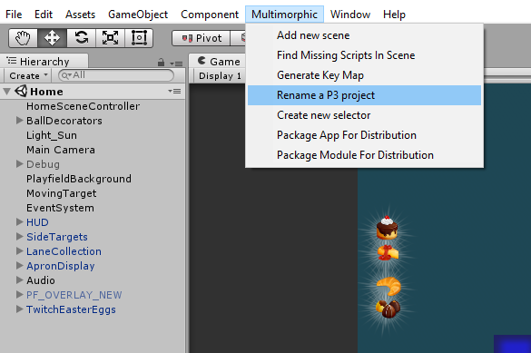
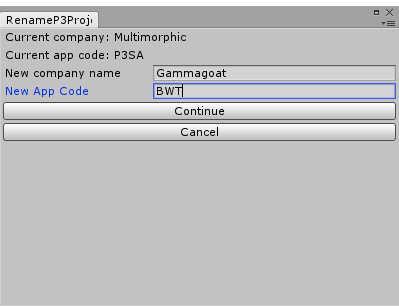
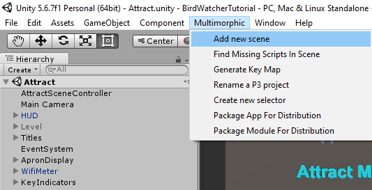
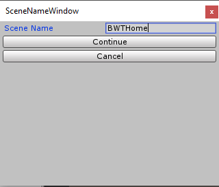

# Setup the Project

## Copying the P3SampleApp

The common practice for developing a P3 game is to start from the provided P3SampleApp.

* Copy the sample project `P3_SDK_V0.8\P3SampleApp` to a new directory. I called mine `BirdWatcherTutorial`.
* Load the new project into Unity
* Use the provided tool to rename the project. Select Multimorphic > Rename a P3 Project. 

    

* Fill out the RenameP3Project form setting the company and App Code.

{: .note }
You can use your own settings here, but it will require some edits as you follow along.

  

We should also edit `Configuration/AppConfig.json` and change our `Name` and the `ModuleID`. We will use Heist for now, but we will try to write this to work on any module.

{::comment}
TODO, fix the comma highlighting as a syntax error
{:/comment}

{: .filename }
Configuration/AppConfig.json

```json
    "Name": "BWT",
    "ModuleID": "Heist"
```

{: .warning }
There is one error in the sample app when conpiled in non-debug mode and your company name is not Multimorphic.

Edit `Assets/Scripts/Modes/BWTBaseGameMode.cs` and Add a Multimorphic to the call to fully qualify the namespace.

{: .filename }
Assets/Scripts/Modes/BWTBaseGameMode.cs:73

```csharp
            Multimorphic.P3App.Logging.Logger.SetExposureLevel(Multimorphic.P3App.Logging.Logger.Exposure.Public);
```

## Revision Control

It is a good practice to use a revision control system. Let's check our new app into git. To play nice with Unity, copy the [Unity.gitignore](https://raw.githubusercontent.com/github/gitignore/main/Unity.gitignore) file to your project directory and rename it .gitignore. You can also do this in powershell with:

{: .filename }
Powershell

```powershell
(new-object System.Net.WebClient).DownloadFile('https://raw.githubusercontent.com/github/gitignore/main/Unity.gitignore',"$pwd\.gitignore")
```

And we will add the following

{: .filename }
.gitignore

```
/Artifacts/
/Documentation/

RecentCertificateData.json
*.cert
```

Now we are ready to check in our code.

{: .filename }
Powershell

```powershell
git init
git add --all
git commit -a -m "Initial commit of BirdWatcherTutorial"
```
## Adding our HomeMode Scene

Now we are ready to make some changes. The sample app has a bunch of really nice features and examples that you can build off, but for this tutorial, we are going to start with a fresh home scene. Let's start in Unity by adding a new P3Scene. 

  * Select Multimorphic > Add new Scene.

    

  * Name our new scene BWTHome

    

We will modify `Assets/Scripts/Modes/BWTBaseGameMode.cs` to call our new mode.

{: .filename }
Assets/Scripts/Modes/BWTBaseGameMode.cs

```csharp
30: private BWTHomeMode homeMode;
56: homeMode = new BWTHomeMode (p3, BWTPriorities.PRIORITY_HOME, "BWTHome");
141: bonusModeEnabled = false;
191: //bonusInfo = homeMode.getBonusInfo();
```

This program should now compile. You should be able to run it with the play button , and it should start the attract mode. If you press  it should start a game, and your new empty scene should show up. It does not yet function as a game, but we will get to that next.

We will also replace the `LauncherMedia` with something more appropriate for our game so we don't get confused with the P3SA. Download [LauncherMedia.zip](assets/images/LauncherMedia.zip) and replace the `LauncherMedia/Icons` with these ones. I did not bother creating auxilary images.

Let's commit this to git.

{: .filename }
Powershell

```powershell
git add .
git commit -a -m "Added new BWTHome Scene"
```