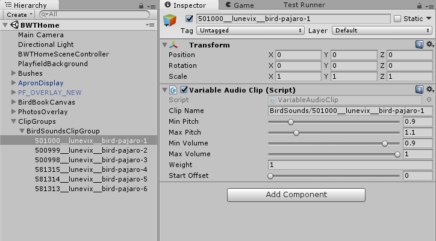
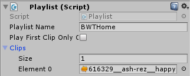

# Adding a Few Sounds

We want to add some incidental sounds during our game. The framework makes this super easy. The sample app is already playing a bunch of sounds already.

We will focus

  * Adding bird calls when we spawn a bird
  * Adding a camera sound when we take a photo

First, where do we get sounds? Good question. You might be skilled enough to make your own. Or you could probably purchase some assets from the Unity store. For this tutorial, I am going to point you at [freesound.org](https://freesound.org/) a repository of sounds licensed under various [Creative Commons licenses](https://creativecommons.org/about/cclicenses/). I recommend reviewing the licenses and understanding them before using them, but I will point you at some CC0 licensed sounds for this tutorial.

## Bird Calls

We make an `AudioClipGroup` of bird sounds, playing a random sound on bird spawn. [Here](https://freesound.org/people/Lunevix/packs/28112/) is a nice collection of short different calls. 

Download and extract this zip to `Assets/Resources/Sound/BirdSounds`

In BWTHome scene create the following

  * An empty object called "ClipGroups"
  * An empty child called "BirdSoundsClipGroup"
    * Add Component `AudioClipGroup`
    * Set the Output Audio Mixer Group to be "Effects"
    * Unset Play Clips Sequentially
  * Add one empty child for each sound
    * Add Component `VariableAudioClip`
    * Set `ClipName` to be the name of the clip.
      * eg. "BirdSounds/501000__lunevix__bird-pajaro-1" **Note that it should not contain the .ogg**
    * Set `MinPitch` to 0.9
    * Set `MaxPitch` to 1.1
    * Set `MinVolume` to 0.9

{: .note }
We set some range of the Pitch and Volume because playing the same identical sound over and over can get very annoying. This will add some small random variation which will hopefully make it less annoying.

It should look something like this.
        


We will add a public string `AudioClipGroup` to `Bird` and a new `PlayBirdCall` method. We could have just done this in `BirdLauncher`, but this could allow us to have different prefabs with different audio groups for different species of birds.

{: .filename }
Assets/Scripts/GUI/BWTHome/Bird.cs

```csharp
        public string AudioClipGroup;

        public void PlayBirdCall()
        {
            BWTAudio.Instance.PlaySound3D(AudioClipGroup, transform, false);
        }
```

Assign the `AudioClipGroup` to `"BirdSoundsClipGroup"`

In `BirdLauncher.SpawnBirdFromIndexEventHandler` add the call to `PlayBirdCall`.

{: .filename }
Assets/Scripts/GUI/BWTHome/BirdLauncher.cs

```csharp
        private void SpawnBirdFromIndexEventHandler(string eventName, object eventData)
        {
            int bushIndex = (int)eventData;
            // Generate a random flight vector. We constrain it to be upwards.
            Vector3 velocity = Bushes[bushIndex].GetComponent<Bush>().RandomDirection();
            // To make the bird face the direction of of movement, we use LookRotation.
            GameObject bird = Instantiate(BirdPrefab, Bushes[bushIndex].transform.position + new Vector3(0,0.5f,0), Quaternion.LookRotation(velocity, new Vector3(0,1,0)));
            bird.transform.SetParent(transform,true);
            bird.GetComponent<Bird>().Velocity = velocity;
            bird.GetComponent<Bird>().PlayBirdCall();
            Destroy(bird, 5);
        }
```

## Adding Camera Sounds

For the camera, we will not use a clip group, but instead just play a single sound. Despite it not making any sense, we thematically use a polaroid camera noise. We can use this [camera Sound](https://freesound.org/people/satanicupsman/sounds/345906/). Download it to `Assets/Resources/Sound/`

At the beginning of `PhotoManager.TakePhoto`,  add a call to `PlaySound3D`.

{: .filename }
Assets/Scripts/GUI/BWTHome/PhotoManager.cs

```csharp
            // Gammagoat.BWT.GUI.PhotoManager.TakePhoto
        
            BWTAudio.Instance.PlaySound3D("345906__satanicupsman__polaroid-taking-picture", pos);
```

{: .note }
I don't know what position to actually set the sound to. In some ways it should actually be at the camera (which is really no location), because the camera is where we are standing and where a camera we take photos of birds are. However, the photo is appearing on the playfield, so we will use that location. In practice there is probably not enough variation in position to matter.

You will notice this sound is not synchronised with the images. There is some silence at the start of the clip, so the sound is delayed from when we trigger it. One simple solution is to just edit the sound in an audio editor, like say Audacity. But we can also do this programmatically. Let's add support to `VariableAudioClip` to start at an offset.

## Adding a startOffset

Add a new member to `VariableAudioClips`. I set the range to `[0, 10]` but there is no reason that it couldn't be more, I just don't have a use for a longer one right now.

{: .filename }
Assets/Scripts/GUI/Audio/VariableAudioClips.cs

```csharp
        [Range(0f, 10f)]
        public float startOffset = 0f;
```

The existing `BWTAudio` supports `AudioClips` and `AudioClipGroups`. We will add support for `VariableAudioClips` that are not in a clip group. First, edit `SetAudioSourceParameters`

{: .filename }
Assets/Scripts/GUI/Audio/BWTAudio.cs

```csharp
        private void SetAudioSourceParameters(AudioSource source, AudioClipGroup clipGroup, VariableAudioClip variableClip)
        {
            if (variableClip)
            {
                source.pitch = Random.Range(variableClip.minPitch, variableClip.maxPitch);
                source.volume = Random.Range(variableClip.minVolume, variableClip.maxVolume);

                if (clipGroup && clipGroup.outputAudioMixerGroup)
                    source.outputAudioMixerGroup = clipGroup.outputAudioMixerGroup;
                else
                    source.outputAudioMixerGroup = defaultMixerGroup;
                source.time = variableClip.startOffset;
            }
            else
            {
                source.pitch = 1f;
                source.volume = 1f;
                source.outputAudioMixerGroup = defaultMixerGroup;
            }
        }
```

In `GetClip`, we will add an `else` clause to load `VariableAudioClip` from the `Assets/Resources/Prefabs/Sound` folder.

{: .filename }
Assets/Scripts/GUI/Audio/BWTAudio.cs

```csharp
            // Gammagoat.BWT.GUI.BWTAudio.GetClip

            if (clipGroups.TryGetValue(name, out clipGroup))
            {
                variableClip = clipGroup.NextClip();
                clipName = variableClip.clipName;
            }
            else
            {
                variableClip = Resources.Load<VariableAudioClip>("Prefabs/Sound/" + clipName);
                if (variableClip)
                    clipName = variableClip.clipName;
            }
```

Create a `VariableAudioClip` of our `CameraSound`.

  * Create an Empty object and name it "CameraSound"
  * Add Component `VariableAudioClip`
  * Set `clipName` to `"345906__satanicupsman__polaroid-taking-picture"`
  * Set `startOffset` to 1.0
  * Drag it into `Prefabs/Sound` and delete it from our scene.

Modify `PhotoManager.TakePhoto()` to play `CameraSound` instead of the exiting call.

{: .filename }
Assets/Scripts/GUI/BWTHome/PhotoManager.cs

```csharp
            // Gammagoat.BWT.GUI.PhotoManager.TakePhoto

            BWTAudio.Instance.PlaySound3D("CameraSound", pos);
```

## Background Music

Our game should have background music. In this section, we walk through adding a Playlist for background music. [Here](https://freesound.org/people/ash_rez/sounds/616329/) is a simple little chiptune loop we can add to the game. Download it to `Resources/Sound/Music`

In the `BWTAudio` prefab, we will change the Home playlist to a BRWDHome playlist and add `"616329__ash-rez__happy-8-bit-music"` as the only element in the playlist.



!!! bug
    If you run this, it will start start playing the audio and immediately stop it.

 The example implementation has a few different ways to play playlists. The default scene change will start the playlist associated with the scene, but it doesn't create a "request" for it. So the watchdog stops the song because there is no highest priority request. We could fix this by requesting the playlist, but we are just going to disable the watchdog logic because we are never going to request two different playlist (e.g. for mode stacking).

In the `BWTAudio.Update` method comment out the following:

{: .filename }
Assets/Scripts/GUI/Audio/BWTAudio.cs

```csharp
            // Gammagoat.BWT.Gammagoat.BWT.GUI.BWTAudio.Update
    
            // Watchdog to make sure the right playlist is playing
            /*watchdogCountdown -= Time.deltaTime;
            if (watchdogCountdown < 0)
            {
                watchdogCountdown = watchdogInterval;

                UpdatePlaylist();
            }
            */
```