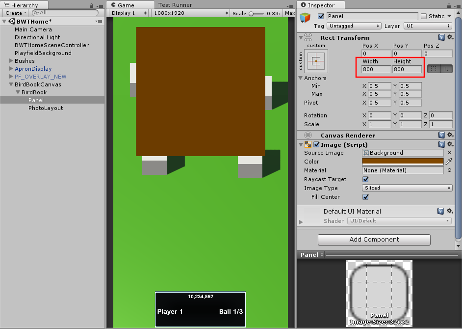
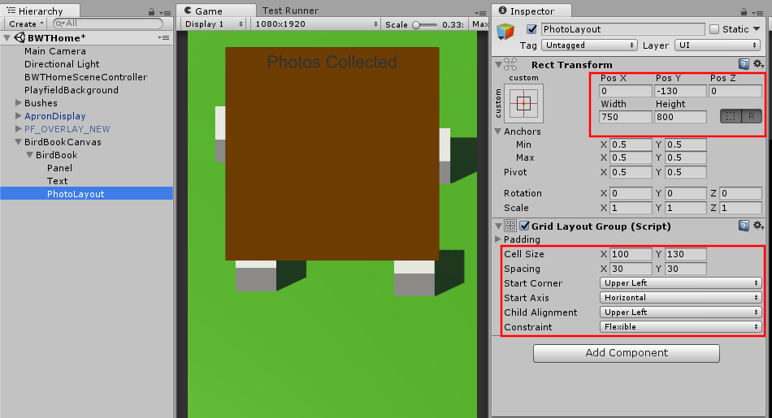
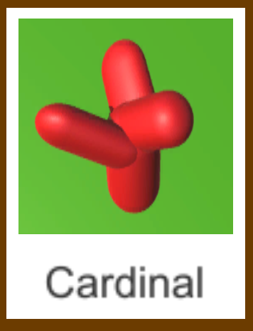
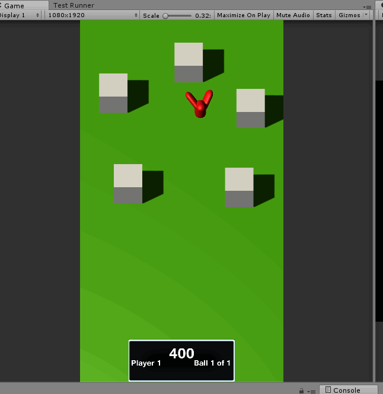
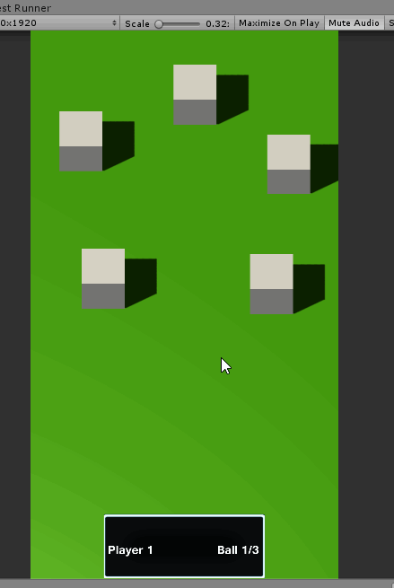

# Adding Polish to the UX

The user really has no idea what is going on right now. Let's add a bunch of visual feedback.

## Launch Instructions

One of the things the Sample app does, and all the commercial apps do, is add a button legend pre-launch. If we had not replaced the default Home mode, and had instead just modified it, we would already have this. But let's look at how to add it ourselves. This is copied from `Assets/Scripts/Modes/SceneModes/HomeMode.cs` with a small modification.

{: .filename }
Assets/Scripts/Modes/SceneModes/BWTHomeMode.cs

```csharp
        private void ShowButtonLegend()
        {
            Dictionary<string, string> buttonLegend = new Dictionary<string, string>();
            // TODO: Fix for upper flipper games.
            buttonLegend["LeftWhiteButton"] = "";
            buttonLegend["RightWhiteButton"] = "";
            buttonLegend["LeftRedButton"] = "Left Flipper\n(+Start): Menu";
            buttonLegend["RightRedButton"] = "Right Flipper\n(+Start): Menu";
            buttonLegend["LeftYellowButton"] = "";
            buttonLegend["RightYellowButton"] = "";
            buttonLegend["LaunchButton"] = "Launch Ball";

            if (data.ball == 1)
            {
                if (data.Players.Count != data.GetGameAttributeValue("MaxPlayers").ToInt())
                {
                    buttonLegend["StartButton"] = "Add Player";
                    if (data.Players.Count > 1)
                        buttonLegend["StartButton"] += "\n(Hold 2s): Remove Player";

                }
                else if (data.Players.Count > 1)
                    buttonLegend["StartButton"] = "(Hold 2s): Remove Player";
            }
            else if (data.GetGameAttributeValue("SoftRestartEnabled").ToBool())
                buttonLegend["StartButton"] = "(Hold 2s): Reset Game";

            PostModeEventToGUI("Evt_ShowButtonLegend", buttonLegend);
        }
```

In `LaunchCallback` add 

{: .filename }
Assets/Scripts/Modes/SceneModes/BWTHomeMode.cs

```csharp
            // Gammagoat.BWT.Modes.BWTHomeMode.LaunchCallback

            PostModeEventToGUI("Evt_HideButtonLegend", null);
```

And in `StartPlaying` we add

{: .filename }
Assets/Scripts/Modes/SceneModes/BWTHomeMode.cs

```csharp
            // Gammagoat.BWT.Modes.BWTHomeMode.StartPlaying

            ShowButtonLegend();
```

## End of Ball

Right now the game just ends. It doesn't show you anything. In my "production" version of this, I place all the photos you collected into a scrapbook. This is more complicated than I want to do here, but let's try a simplified version of it.

In Unity, we are going to create a new Canvas called BirdBookCanvas.

  * Add a new Canvas, delete the EventSystem and rename it BirdBookCanvas.
  * Add an Empty child called BirdBook.
    * Create a child panel object of size 800 x 800.
    <br> 
    * Create a child Text object that says "Photos Collected".
    * Create a Empty child names PhotoLayout, positioning it at the top of the panel.
      * Add a Grid Layout Group.
        * Cell size 100, 130.
        * Cell spacing 30, 30.
        <br> 

Create a Photo prefab that looks like a photo. I made this using 2D objects, but you could create it in a photo program if you prefer.


Create a new GUI script `Assets/Scripts/GUI/BWTHome/BirdBook.cs`

{: .filename }
Assets/Scripts/GUI/BWTHome/BirdBook.cs

```csharp
using UnityEngine;
using Multimorphic.P3App.GUI;
using Gammagoat.BWT.Modes;

namespace Gammagoat.BWT.GUI
{
    public class BirdBook : P3Aware
    {
        public GameObject PhotoLayout;
        public GameObject PhotoPrefab;

        public override void Start ()
        {
            base.Start ();
        }

        protected override void CreateEventHandlers()
        {
            base.CreateEventHandlers ();
        }

        // Update is called once per frame
        public override void Update ()
        {
            base.Update ();
        }
    }
}
```

Add this script as a component to the `BirdBook` GameObject we created. Set the `PhotoPrefab` and `PhotoLayout` to the appropriate `GameObject`s.

As usual, we define new constants in `BWTEventNames`.

{: .filename }
Assets/Scripts/Modes/BWTEventNames.cs

```csharp
        public const string AnimatePhotos = "Evt_AnimatePhotos";
        public const string ShowBirdBook = "Evt_ShowBirdBook";
        public const string PhotoAnimationComplete = "Evt_PhotoAnimationComplete";
```

In `BirdBook` register the new `EventHandlers`.

{: .filename }
Assets/Scripts/GUI/BWTHome/BirdBook.cs

```csharp
        protected override void CreateEventHandlers()
        {
            base.CreateEventHandlers ();
            AddModeEventHandler(BWTEventNames.AnimatePhotos, AnimatePhotosEventHandler);
            AddModeEventHandler(BWTEventNames.ShowBirdBook, ShowBirdBookEventHandler);
        }
```

`ShowBirdBook` is a simple toggle that enables or hides the `Canvas` based on the `bool` sent through `eventData`. We use this to hide it at the start of the game, and show it at the end of the ball.

{: .filename }
Assets/Scripts/GUI/BWTHome/BirdBook.cs

```csharp
        public void ShowBirdBookEventHandler(string eventName, object eventData)
        {
            bool enable = (bool)eventData;
            GetComponentInParent<Canvas>().enabled = enable;
        }
```

`AnimatePhotos` initializes some member variables that animate the revealing of photos in the `Update` method. Add three new private member variables.

{: .filename }
Assets/Scripts/GUI/BWTHome/BirdBook.cs

```csharp
        private bool _animatePhotos;
        private double _timeToNextPhoto;
        private int _photosLeft;

        public void AnimatePhotosEventHandler(string eventName, object eventData)
        {
            _photosLeft = (int)eventData;
            _animatePhotos = true;
            _timeToNextPhoto = 0.2;
        }
```

Create a method to instantiate the `Photo` prefab as a child of the PhotoLayout.

{: .filename }
Assets/Scripts/GUI/BWTHome/BirdBook.cs

```csharp
        public void AddPhoto()
        {
            GameObject photo = Instantiate(PhotoPrefab, Vector3.zero, Quaternion.identity);
            photo.transform.SetParent(PhotoLayout.transform, false);
        }
```

Now we have all the pieces to implement our `Update` method. When the animation is complete, fire the `PhotoAnimationComplete` event.

{: .filename }
Assets/Scripts/GUI/BWTHome/BirdBook.cs

```csharp
        // Update is called once per frame
        public override void Update ()
        {
            base.Update ();
            if (_animatePhotos)
            {
                _timeToNextPhoto -= Time.deltaTime;
                if (_timeToNextPhoto <= 0)
                {
                    AddPhoto();
                    _photosLeft--;
                    if (_photosLeft <= 0)
                    {
                        _animatePhotos = false;
                        PostGUIEventToModes(BWTEventNames.PhotoAnimationComplete, null);
                    }
                    else
                    {
                        _timeToNextPhoto = 0.2;
                    }
                }
            }
        }
```

In order to call this, we need to keep track of the number of photos taken. We add a counter to `BirdRampMode`, initialize it to zero in `mode_started`, increment it in `BirdHit`, and add a new public method to retrieve the value.

{: .filename }
Assets/Scripts/Modes/GameModes/BirdRampMode.cs

```csharp
        private int _photoCount;

        public void BirdHitEventHandler(string eventName, object eventData)
        {
            int score = (int)eventData;
            ScoreManager.Score(score); 
            _photoCount++;
        }

        public int GetPhotoCount()
        {
            return _photoCount;
        }
```

Putting it all together in `BWTHomeMode`, add / update the following:

{: .filename }
Assets/Scripts/Modes/SceneModes/BWTHomeMode.cs

```csharp
        private void MainTimerExpired()
        {
            PostModeEventToModes(BWTEventNames.MainTimerExpired, null);
            EndOfBallAnimation();
        }

        private void EndOfBallAnimation()
        {
            PostModeEventToModes ("Evt_EnableFlippers", false);
            PostModeEventToModes ("Evt_EnableBumpers", false);
            AddGUIEventHandler(BWTEventNames.PhotoAnimationComplete, AnimationCompleteEventHandler);
            PostModeEventToGUI(BWTEventNames.ShowBirdBook, true);
            PostModeEventToGUI(BWTEventNames.AnimatePhotos, _birdRampMode.GetPhotoCount());
        }

        public void AnimationCompleteEventHandler(string eventName, object eventData)
        {
            this.delay("EndOfGame", Multimorphic.NetProc.EventType.None, (double)(5), new Multimorphic.P3.VoidDelegateNoArgs (CompleteGame));
        }

        public void CompleteGame()
        {
            cancel_delayed("EndOfGame");
            End();
        }
```

In `StartPlaying`, also add a

{: .filename }
Assets/Scripts/Modes/SceneModes/BWTHomeMode.cs

```csharp
            // Gammagoat.BWT.Modes.BWTHomeMode.StartPlaying

            PostModeEventToGUI(BWTEventNames.ShowBirdBook, false);
```

{: .note }
If you toggle the Canvas component off, this isn't needed, but we will add it anyway. This doesn't actually hide the object soon enough, so it flashes on the screen before hiding it.

If you run this in the simulator, it should now show the animation at the end of the ball. There is one bug and one quality of life change. First the bug.

!!! bug
    If you didn't take any photos, it still shows one photo.

There are multiple ways we can fix this, but we will do it in `AnimatePhotosEventHandler`

{: .filename }
Assets/Scripts/GUI/BWTHome/BirdBook.cs

```csharp
        public void AnimatePhotosEventHandler(string eventName, object eventData)
        {
            _photosLeft = (int)eventData;
            // if there are no Photos, just short circuit the animation call.
            if (_photosLeft <= 0)
            {
                _animatePhotos = false;
                PostGUIEventToModes(BWTEventNames.PhotoAnimationComplete, null);
            }
            else
            {
                _animatePhotos = true;
                _timeToNextPhoto = 0.2;
            }
        }
```

The second thing is that we show the BirdBook for 5 seconds, but players might want to dismiss it. The traditional pinball way is a double flip, so let's add a double-flip to end.

{: .filename }
Assets/Scripts/Modes/SceneModes/BWTHomeMode.cs

```csharp
        public override bool sw_buttonLeft0_active(Switch sw)
        {
            if (p3.Switches["buttonRight0"].IsActive())
            {
                PostModeEventToModes("DoubleFlip", null);
            }
            return SWITCH_CONTINUE;
        }

        public override bool sw_buttonRight0_active(Switch sw)
        {
            if (p3.Switches["buttonLeft0"].IsActive())
            {
                PostModeEventToModes("DoubleFlip", null);
            }
            return SWITCH_CONTINUE;
        }
```

In `EndOfBallAnimation` add:

{: .filename }
Assets/Scripts/Modes/SceneModes/BWTHomeMode.cs

```csharp
            // Gammagoat.BWT.Modes.BWTHomeMode.EndOfBallAnimation

            AddModeEventHandler("DoubleFlip", DoubleFlipEventHandler, Priority);
```

And finally, implement the new `DoubleFlipEventHandler`.

{: .filename }
Assets/Scripts/Modes/SceneModes/BWTHomeMode.cs

```csharp
        private bool DoubleFlipEventHandler(string eventName, object eventData)
        {
            CompleteGame();
            return EVENT_STOP;
        }
```

The result of all this is we get an end of ball animation that looks something like this.



## Taking Photos

{: .bug }
While testing the previous section, I noticed that our `OnTriggerEnter` can be activated multiple times for the same bird. We will fix that in the next section.

Let's make our birds get replaced with a photo when they are hit. Create a new `Canvas` named "PhotosOverlay". Add a new script to it: `PhotoManager.cs`

{: .filename }
Assets/Scripts/GUI/BWTHome/PhotoManager.cs

```csharp
using UnityEngine;
using Multimorphic.P3App.GUI;

namespace Gammagoat.BWT.GUI
{
    public class PhotoManager : P3Aware
    {
        public Camera MainCamera;
        public override void Start ()
        {
            base.Start ();
        }

        protected override void CreateEventHandlers()
        {
            base.CreateEventHandlers ();
        }

        // Update is called once per frame
        public override void Update ()
        {
            base.Update ();
        }

        public void TakePhoto(GameObject prefab, Vector3 pos)
        {
            Vector3 screenPos = MainCamera.WorldToScreenPoint(pos);
            GameObject photo = Instantiate(prefab, screenPos, Quaternion.identity);
            photo.transform.localScale = new Vector3(1.3f, 1.3f, 1.3f);
            photo.transform.SetParent(transform, true);
            Destroy(photo, 3);
        }
    }
}
```

Set `MainCamera` to the main camera in the scene. Now we need to call it from the `OnHit` method.

In `Bird` add the following member variables. 

{: .filename }
Assets/Scripts/GUI/BWTHome/Bird.cs

```csharp
        public GameObject PhotoPrefab;
        private GameObject _photoManager;
        private bool _lockout;
```

In the `Start` add the following:

{: .filename }
Assets/Scripts/GUI/BWTHome/Bird.cs

```csharp
            // Gammagoat.BWT.GUI.Bird.Start

            _photoManager = GameObject.Find("PhotosOverlay");
```

And finally, change the `OnTriggerEnter`:

{: .filename }
Assets/Scripts/GUI/BWTHome/Bird.cs

```csharp
        public void OnTriggerEnter(Collider other)
        {
            if (_lockout)
            {
                return;
            }
            // Only respond to ball hits
            if (other.name == "BallAvatarTrail")
            {
                _lockout = true;
                PostGUIEventToModes(BWTEventNames.BirdHit, Score);
                _photoManager.GetComponent<PhotoManager>().TakePhoto(PhotoPrefab, transform.position);
                Destroy(gameObject);
            }
        }
```

## Adding a Timer Indicator to the Screen

The `TimerMode` class we are using already is sending events to the GUI layer. We can provide some visual feedback to the user to give them an indication of how long they have left. We create a script that can be added to any Text GameObject that will update the string based on the timer values. Create `Assets/Scripts/GUI/BWTHome/TimerDisplay.cs`:

{: .filename }
Assets/Scripts/GUI/BWTHome/TimerDisplay.cs

```csharp
using UnityEngine;
using UnityEngine.UI;
using Multimorphic.P3App.GUI;

namespace Gammagoat.BWT.GUI
{
    public class TimerDisplay : P3Aware {

        public string TimerName;

        public override void Start ()
        {
            base.Start ();
        }

        protected override void CreateEventHandlers()
        {
            base.CreateEventHandlers ();
            AddModeEventHandler("Evt_" + TimerName + "TimerTick", UpdateTimeEventHandler);
            AddModeEventHandler("Evt_" + TimerName + "TimerStart", UpdateTimeEventHandler);
        }

        public void UpdateTimeEventHandler(string eventName, object eventData)
        {
            GetComponent<Text>().text = ((int)eventData).ToString();
        }

        // Update is called once per frame
        public override void Update ()
        {
            base.Update ();
        }
    }
}
```

Adding this to a text UI Element added in the center of the screen and setting the `TimerName` to "Main" will give us a countdown.


